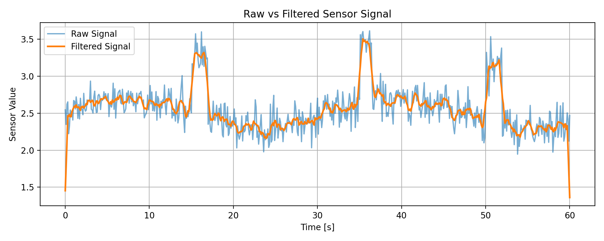
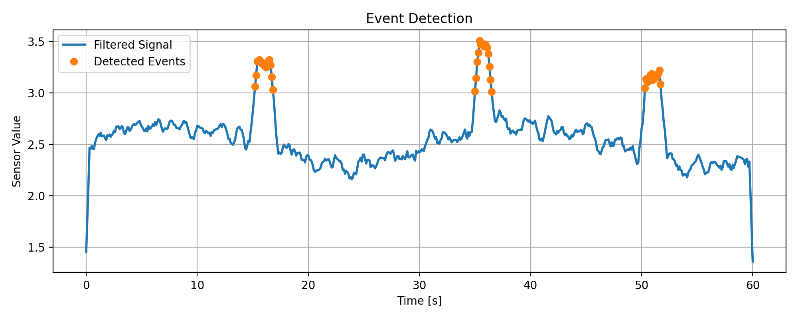
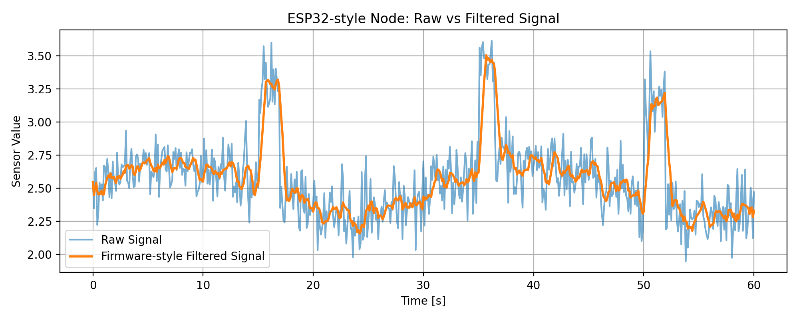
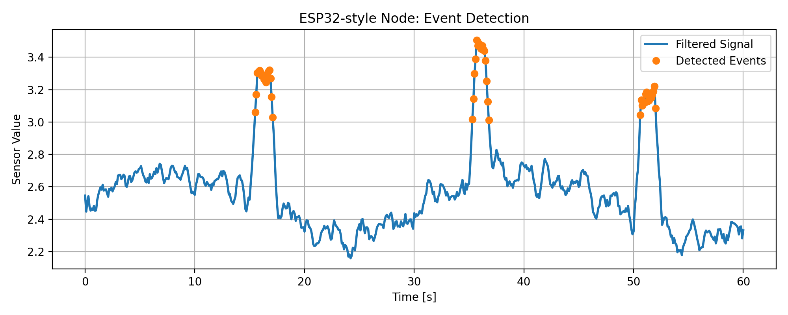
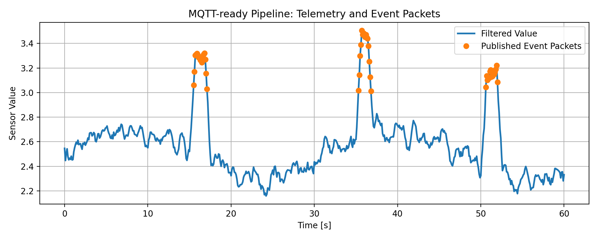
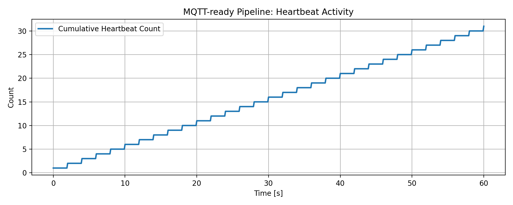
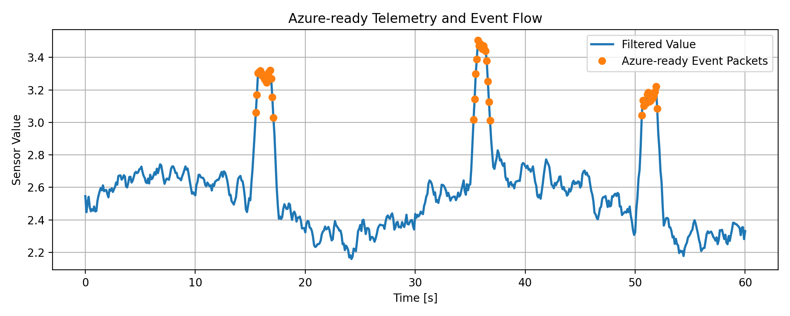
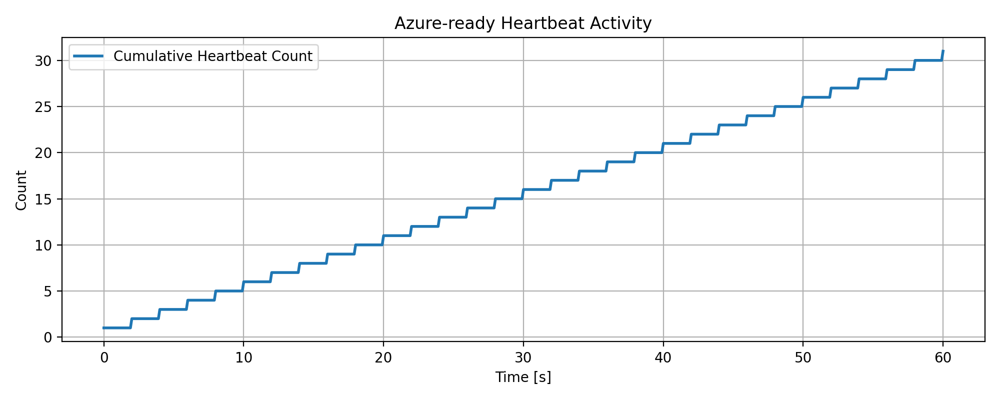

# ESP32 IoT Sensor Node with Edge Filtering

## Overview

This project simulates the core logic of an IoT sensor node designed for ESP32-based edge monitoring applications.

The node is intended to:

* acquire sensor data
* apply lightweight edge filtering
* detect events locally
# ESP32 IoT Sensor Node with Edge Filtering, MQTT-Ready Telemetry, and Azure-Ready Integration

## 📌 Overview

This project demonstrates the architecture of an **ESP32-style IoT sensor node** designed for edge monitoring and cloud-ready telemetry applications.

The project includes:

* simulated sensor data acquisition
* edge-side filtering
* threshold-based event detection
* firmware-style sample-by-sample node logic
* telemetry packet generation
* heartbeat/status messaging
* MQTT-ready topic routing
* Azure-ready telemetry schema design

This project highlights skills in:

* IoT system architecture
* Embedded-oriented firmware logic
* Edge filtering and event detection
* Telemetry design
* MQTT-style communication flow
* Azure-ready cloud integration thinking

---

## 🎯 Objective

* simulate a real-time sensor stream
* apply lightweight edge filtering
* detect threshold-based events locally
* generate telemetry, heartbeat, and event packets
* organize a mock MQTT telemetry flow
* build Azure-ready packet structures for future cloud integration

---

## ⚙️ Methodology

### 1. Sensor Stream Simulation

A time-series sensor signal is simulated with:

* baseline dynamics
* Gaussian noise
* injected event spikes

This represents the behavior of a real embedded sensing system under noisy operating conditions.

### 2. Edge Filtering

A lightweight moving-average filter is applied to the raw signal to mimic edge-side preprocessing on a constrained embedded device.

### 3. Local Event Detection

Threshold-based logic is used to detect relevant signal events locally on the node.

This reflects a common IoT pattern:

* collect raw signal
* preprocess locally
* trigger event-driven communication when needed

### 4. Firmware-Style Node Design

A firmware-style node class was developed to simulate ESP32-like sample-by-sample execution.

The node performs:

* filtering
* event detection
* telemetry packet generation
* heartbeat generation

### 5. MQTT-Ready Pipeline

A mock MQTT broker and publisher were implemented to test:

* telemetry publishing
* heartbeat topic flow
* event topic flow
* topic-based routing structure

### 6. Azure-Ready Packet Design

A cloud-ready telemetry schema was added with:

* device metadata
* firmware version
* message type
* signal quality
* heartbeat status
* event severity

This makes the project closer to real Azure IoT integration patterns.

---

## 📊 Example Results

### 🔹 Raw vs Filtered Signal



### 🔹 Event Detection



### 🔹 ESP32-Style Filtered Signal



### 🔹 ESP32-Style Event Detection



### 🔹 MQTT-Ready Event Summary



### 🔹 MQTT-Ready Heartbeat Summary



### 🔹 Azure-Ready Event Summary



### 🔹 Azure-Ready Heartbeat Summary



---

## ✅ Baseline Sensor Processing

The initial stage of the project established:

* raw sensor signal simulation
* edge-side filtering
* local event detection

This created the core sensing and signal-processing logic for the rest of the system.

---

## ✅ Firmware-Style IoT Node

A step-based ESP32-style node implementation was built to support:

* one-sample-at-a-time processing
* telemetry packet creation
* heartbeat logic
* local event flagging

Generated packet counts:

* **Telemetry packets:** 601
* **Heartbeat packets:** 31

This confirms the node behaves as a periodic telemetry source with background health monitoring.

---

## ✅ MQTT-Ready Pipeline

A mock MQTT pipeline was created to simulate:

* telemetry publishing
* heartbeat publishing
* event-based publishing
* topic routing

Generated packet counts:

* **Telemetry packets:** 601
* **Heartbeat packets:** 31
* **Event packets:** 48

This stage demonstrates an IoT-ready message flow architecture without requiring a live broker.

---

## ✅ Azure-Ready Telemetry Architecture

The telemetry system was extended with Azure-style packet structures that include:

* device ID
* device type
* firmware version
* location
* cloud timestamp
* message type
* signal quality
* heartbeat status
* event severity

Generated packet counts:

* **Telemetry packets:** 601
* **Heartbeat packets:** 31
* **Event packets:** 48

This confirms that the node and telemetry architecture are ready for future Azure IoT Hub integration.

---

## 📁 Project Structure

```text id="tmwr7x"
esp32-iot-sensor-node/
│
├── src/
│   ├── main.py
│   ├── esp32_node.py
│   ├── test_esp32_node.py
│   ├── mqtt_client_mock.py
│   ├── test_mqtt_pipeline.py
│   ├── azure_packet_builder.py
│   └── test_azure_ready_pipeline.py
│
├── data/
├── results/
├── figures/
│
├── README.md
└── requirements.txt
```

---

## ▶️ How to Run

Install dependencies:

```bash id="hywwh1"
pip install numpy matplotlib pandas
```

Run the baseline sensor processing stage:

```bash id="gencn5"
python src/main.py
```

Run the firmware-style ESP32 node simulation:

```bash id="fvi1c0"
python src/test_esp32_node.py
```

Run the MQTT-ready telemetry pipeline:

```bash id="nrfcwl"
python src/test_mqtt_pipeline.py
```

Run the Azure-ready telemetry pipeline:

```bash id="njle2z"
python src/test_azure_ready_pipeline.py
```

---

## 📈 Output

The project generates:

* filtered signal plots
* event detection plots
* firmware-style packet flow outputs
* MQTT-ready telemetry logs
* Azure-ready telemetry logs
* packet summaries
* sample packet JSON files

---

## 🚀 Features

* simulated sensor acquisition
* lightweight edge filtering
* local threshold-based event detection
* firmware-style node execution
* telemetry packet generation
* heartbeat packet generation
* MQTT-ready topic routing
* Azure-ready message structure
* cloud-oriented metadata and status fields

---

## 🔧 Future Work

* connect the pipeline to a real MQTT broker
* connect the node to Azure IoT Hub
* add reconnect logic and buffering
* add configuration updates / remote parameter control
* deploy the logic on real ESP32 hardware
* support multiple sensor channels
* add anomaly detection beyond simple threshold logic

---

## 🧠 Key Takeaway

This project demonstrates how an IoT sensor node can be designed from the edge to the cloud:

* sensing
* filtering
* event detection
* telemetry generation
* heartbeat monitoring
* MQTT-style transport
* Azure-ready telemetry schema

It provides a strong system-level example of **embedded IoT architecture** and **cloud-ready telemetry design**.

---

## 👤 Author

Hossein Electronics Engineer
